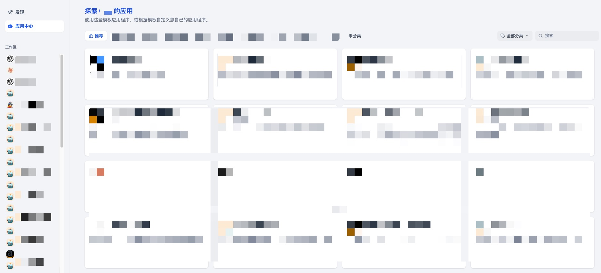
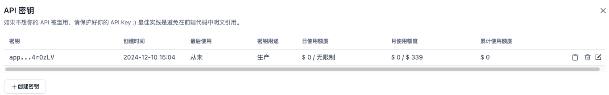
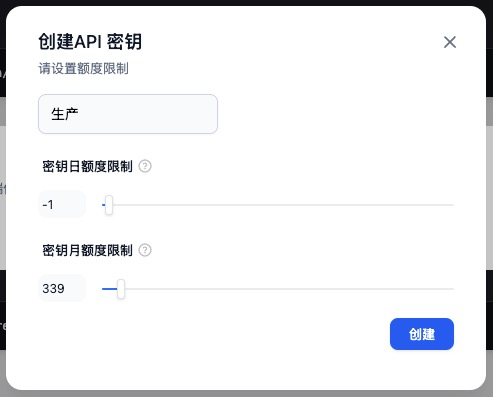
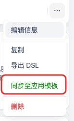
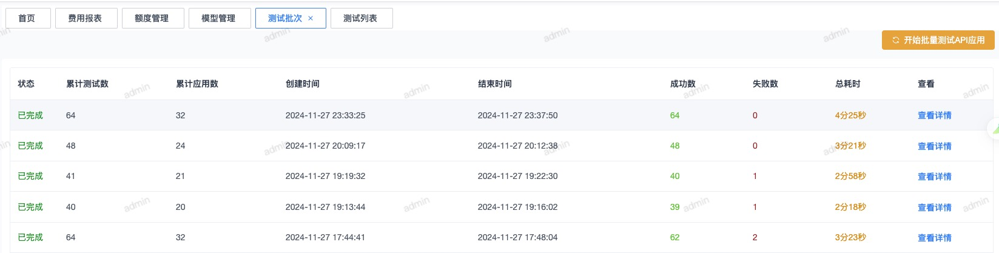
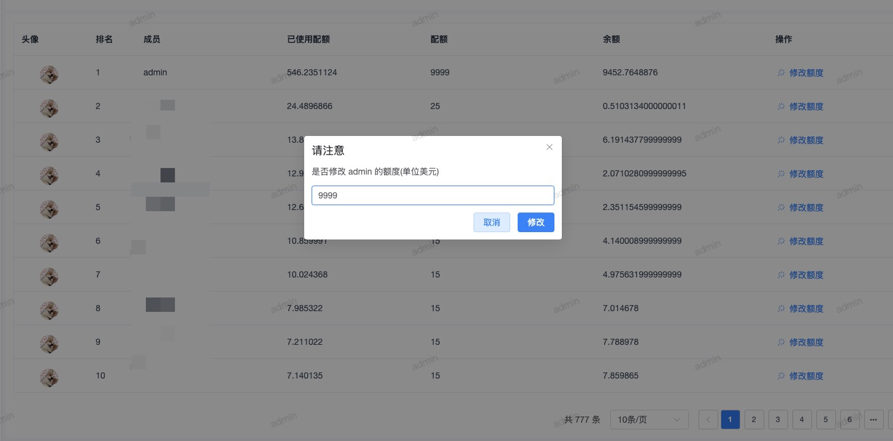
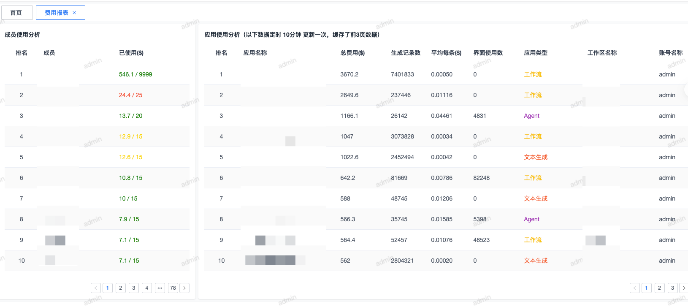
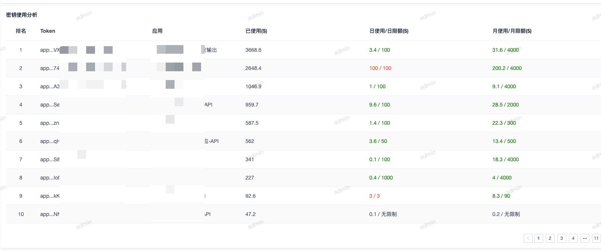
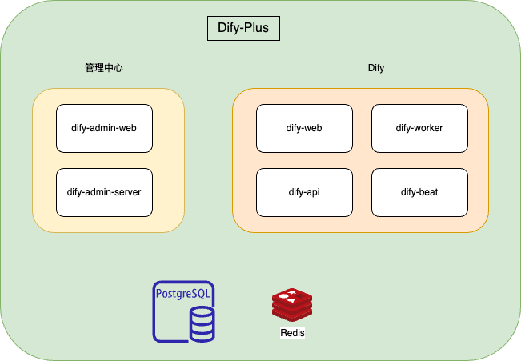

# Dify-Plus

## 项目介绍

在原有 Dify 的基础中，该项目做了一些二开以及新增了管理中心的功能，原先这些功能只是在我们企业内部使用，对外交流后发现很多伙伴也遇到我们相同一些痛点，故将我们的二开内容进行开源，欢迎大家一起交流。

简而言之：该项目基于 [gin-vue-admin](https://github.com/flipped-aurora/gin-vue-admin) 做了 Dify 的管理中心，基于  [Dify](https://github.com/langgenius/dify) 做了一些适合企业场景的二开功能。

即 *Dify-Plus* = *管理中心* + *Dify 二开*

## 名字说明

Dify-Plus，该名字不是说比 Dify 项目牛的意思，意思是想说比 Dify 多做了一些针对企业场景多了一些二开的功能而已。

## 新增功能介绍

### 一.  Dify 二开功能
1.  新增：用户额度
    1.  对话余额限制判断
    2.  异步计算用户额度逻辑
    3.  左上角新增使用额度显示
    4.  新增个人监测页
2.  新增：密钥额度设置
    1.  新增应用 API 调用余额限制判断
3.  新增 ：Web 公开页登录鉴权
4.  新增：管理员同步应用到应用模版
5.  新增：初次注册用户，默认加入默认空间
6.  新增：可以鉴权的 cookie
7.  新增：同步应用到模版中心
8.  新增：应用中心页面
9.  调整 ：默认跳转到应用中心
10.  新增：应用使用次数记录、应用中心按照使用次数排序
11.  权限调整
     1.  调整：不允许普通成员关闭模型
     2.  调整：空间普通成员不渲染“模型供应商”标签
     3.  调整：非管理员，隐藏密钥显示 
     4. 优化： csv 编码监测，修复批量请求，windows 下载后保存再上传问题
     5. 优化： markdown 图片放大问题优化
## 二. 管理中心
> 代码所在目录：/admin
1.  JWT 与 Dify 打通
2.  用户同步
3.  模型同步工作区
4.  用户额度修改
5.  费用报表

## 部分功能页面展示截图

1. 应用中心

   

1. API密钥列表

   

1. 创建API密钥

   

1. 用户额度显示

   

1. 同步至应用模版

   

1. API调用测试

   

1. 个人额度修改

   

1. 费用报表

   

1. 密钥使用分析

   

1. 每月密钥额度花费

   


## 版本更新说明

1. 会持续跟随 gin-vue-admin 和 Dify 两个开源项目的版本，合并最新代码，最多不超过 1 天。
2. 为了标志二开的部分，我们特意在注释、文件名、方法名、表名都加上`extend`，可通过搜索这个关键字，查看我们二开的代码

## 整体服务



## 源码启动方式
> 启动方式跟原来的开源项目一致，这里只简单写了一种源码的启动方式

### 1. 前置依赖

#### 语言版本

*   python 版本：3.11 or 3.12
*   node 版本：>=18.17.0
*   golang 版本：1.22.0

#### 基础服务

*   Redis

*   pgSQL

### 2. 启动步骤
#### 启动 api 服务

```shell
dev/sync-poetry
cd api
flask db upgrade
flask run --host 0.0.0.0 --port=5001 --debug
```

#### 启动 web 服务

```shell
cd web
yarn install
yarn run dev
```

#### 启动 worker 服务

```shell
celery -A app.celery worker -P gevent -c 1 -Q -dataset,mail,ops_trace,app_deletion,extend_high,extend_low --loglevel INFO 
```

#### 启动 beat 服务

```shell
celery -A app.celery beat --loglevel INFO 
```

#### 启动 admin-web 服务

```shell
cd admin/web
yarn install
yarn run dev
```

#### 启动 admin-server 服务

```shell
cd admin/server
go mod tidy
go run main.go
```

## 联系我们

toxingwang@gmail.com

## License

版权说明：本项目在 Dify 项目基础上进行二开，需要遵守 Dify 的开源协议，如下

This repository is available under the [Dify Open Source License](LICENSE), which is essentially Apache 2.0 with a few additional restrictions.
